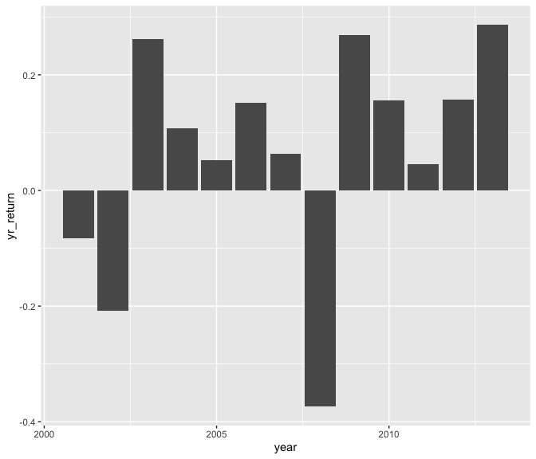

W2LECTURE-240124
================
niyun
2024-01-24

- [Read in data](#read-in-data)
- [Statistics on returns](#statistics-on-returns)
- [S&P Prices](#sp-prices)
- [S&P Yearly Returns](#sp-yearly-returns)

## Read in data

``` r
wk2_stocks <- readRDS("wk2_stocks.rds")
str(wk2_stocks)
```

    ## 'data.frame':    5798 obs. of  4 variables:
    ##  $ SPY_prices : num  88.1 87.1 84.3 84.9 84.7 ...
    ##  $ SPY_returns: num  0.04804 -0.01076 -0.03264 0.00774 -0.00264 ...
    ##  $ SPY_vol    : num  88.1 87.1 84.3 84.9 84.7 ...
    ##  $ date       : Date, format: "2001-01-03" "2001-01-04" ...

## Statistics on returns

``` r
sum(wk2_stocks$SPY_returns) * 100
```

    ## [1] 218.3304

``` r
mean(wk2_stocks$SPY_returns) * 100
```

    ## [1] 0.03765616

``` r
sd(wk2_stocks$SPY_returns) * 100
```

    ## [1] 1.221943

- The cumulative returns of the S&P index during this period is 218.33%

- The average daily returns of the S&P index during this period is 0.04%

- The standard deviation of the daily returns of the S&P index during
  this period is 1.22%

## S&P Prices

``` r
library(tidyverse) 
ggplot(data = wk2_stocks, aes(x = date, y = SPY_prices)) + geom_line()
```

<!-- -->

## S&P Yearly Returns

``` r
wk2_stocks %>%
  mutate(year = year(date)) %>% 
  filter (year <= 2013) %>%
  group_by(year) %>%
  summarize(yr_return = sum(SPY_returns)) %>%
  ggplot(aes(x = year, y = yr_return)) + geom_col()
```

<!-- -->
